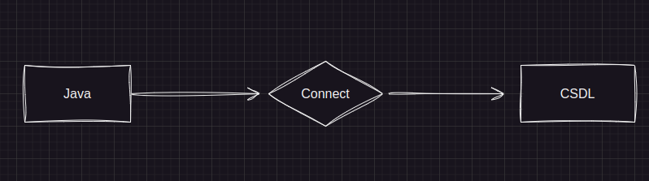

# KẾT NỐI CƠ SỠ DỮ LIỆU VỚI JAVA.

## 1. Giải Thích

Ứng dụng Java muốn **Kết nối** và **Trao đổi** Thông tin với cơ sở dữ liệu thì điều đầu tiên chúng ta cần **Tạo mối quan hệ giữa chúng** hay **Kết nối** chúng lại với nhau.

