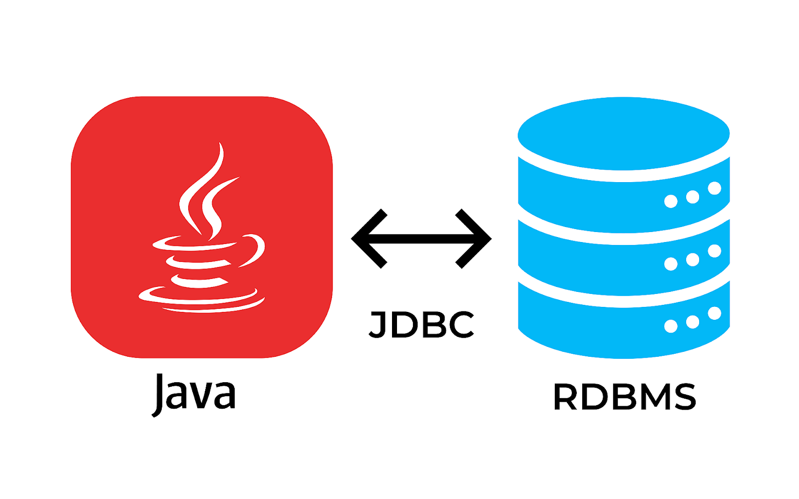
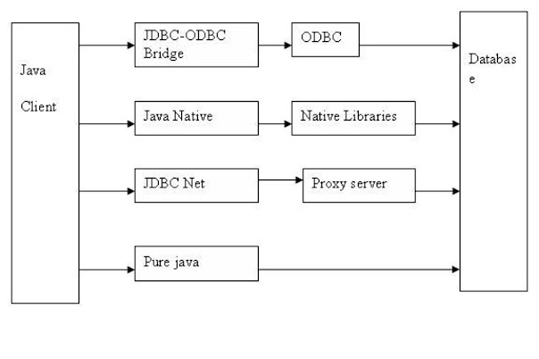

# KẾT NỐI CƠ SỠ DỮ LIỆU VỚI JAVA.

## 1. Giải Thích


Ứng dụng Java muốn **Kết nối** và **Trao đổi** Thông tin với cơ sở dữ liệu thì điều đầu tiên chúng ta cần **Tạo mối quan hệ giữa chúng** hay **Kết nối** chúng lại với nhau.

## 2. Giới Thiệu JDBC.

JDBC (Java Database Connectivity) là một **API** được thiết kế dành cho ngôn ngữ lập trình Java hỗ trợ Java trong việc truy vấn với CSDL. Nó gồm các phương thức thực hiện truy vấn và cập nhật CSDL gián tiếp qua JAVA.



***JDBC***



Theo hình có  4 loại **JDBC Driver** . Loại mới nhất và chúng ta đang sử dụng là loại số 4 **Pure Java**.

[Tham Khảo sự khác biệt giữa 4 loại Driver](https://www.java67.com/2015/07/difference-between-type-1-2-3-and-4-jdbc-drivers-java.html#:~:text=The%20difference%20between%20different%20types%20of%20JDBC%20drivers%20comes%20from,and%20gives%20the%20best%20performance)

## 3. Các Bước Kết Nối Với CSDL.

1. Tải về trình điều khiển JDBC và thêm vào đường dẫn module trong project Java.

- [Type 4 mysql Jar driver Connection](https://jar-download.com/artifacts/mysql/mysql-connector-java)

2. Đăng kí trình điều khiển JDBC với DriverManager.

- *Note*:
  Từ JDK8 trở về trước ta bắt buộc phải đăng kí JDBC với DriverManager.

  ``` java 
  DriverManager.registerDriver(new com.mysql.jdbc.Driver());
  ```

  Từ JDK9 trở về sau ta không cần đăng kí JDBC với DriverManager (Tự đăng kí với DriverManager). Nếu muốn tự đăng kí --> thêm package cj trong phần đăng kí.
  ``` java 
  DriverManager.registerDriver(new com.mysql.cj.jdbc.Driver());
  ```
## 3.Xây dựng Một URL kết nối 
Một *URL* bao gồm :
1. Link của Database. ``` jdbc:mysql://localhost:```
2. Port     ```3306 ```
3. Database ```ontap ```
4. Username ```root```
5. Password. ```mật khẩu```

``` java
String url = "jdbc:mysql://localhost:3306/ontap";
String username = "root";
String password = "@dz251914423700";
```